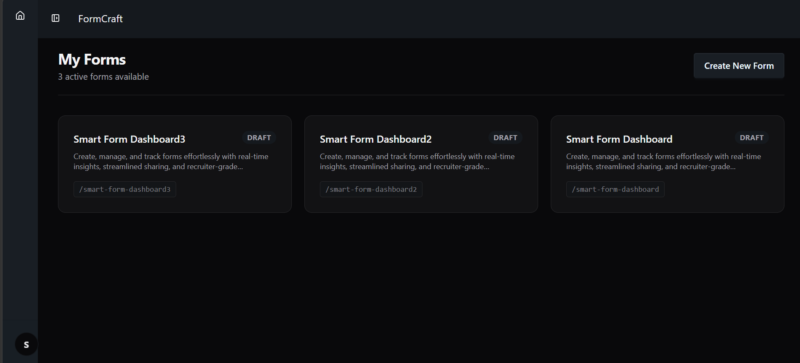
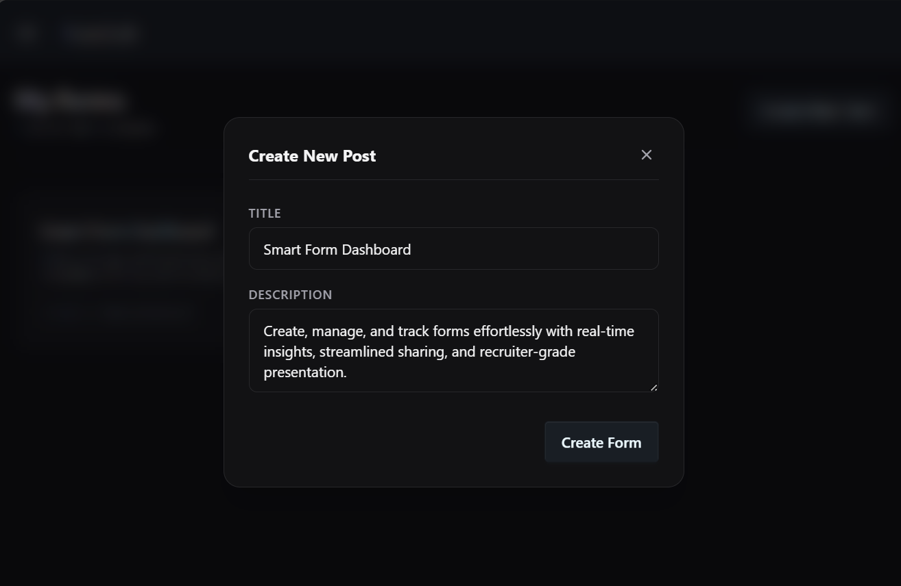
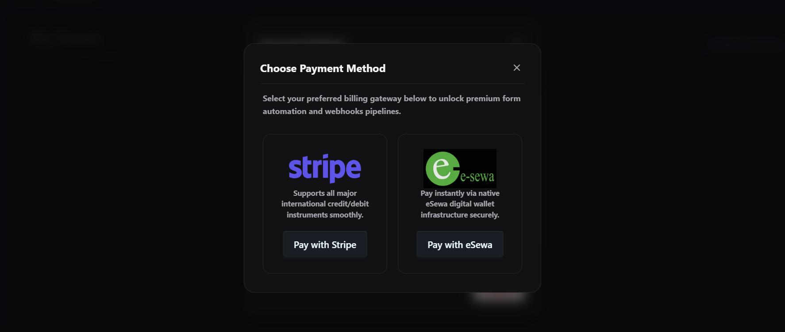

# FormCraft

A lightweight SaaS form builder built as a portfolio project to demonstrate real-world SaaS engineering — tiered access control, dual-gateway payment integration, and a production-grade full-stack architecture.

---
## Screenshots
| Form Dashboard | Create Form | Payment Gateway |
|---|---|---|
|  |  |  |

---
## Demo Videos
 
### 1. eSewa Checkout (Local)
 
https://github.com/user-attachments/assets/2551451e-e783-4036-8125-39719efcd0a7
 
> Demonstrates provisioning the baseline allocation of 3 forms, encountering the application paywall, triggering a checkout request, and unlocking additional creation capacity via local eSewa sandbox routing.

### 2. Stripe Checkout (International)
https://github.com/user-attachments/assets/6fc79001-30a9-43a6-be29-92a50ae8c046
 
> Showcases the global checkout pipeline with Stripe, illustrating smooth token-handling, client redirect states, and immediate database subscription updates on successful transaction callback.
 
---


## Live Demo

> **Web App:** https://formcraft-eight.vercel.app/
> **Backend API:** Hosted on Render

---

## What It Does

FormCraft lets users create and share forms with a free tier (up to 3 forms). Once the limit is hit, the app dynamically blocks further creation and presents an upgrade paywall backed by two payment gateways — eSewa for local users and Stripe for international.

### Core Features

- **Tiered Paywall** — Free users can create up to 3 forms. Hitting the limit triggers a paywall UI that routes to payment.
- **eSewa Integration (Sandbox)** — Local payment flow for Nepal-based users, with server-side signature validation.
- **Stripe Integration (Test Mode)** — International card checkout via Stripe Checkout Sessions.
- **BFF Architecture** — Next.js Route Handlers proxy all backend calls, keeping Django URLs and third-party credentials off the client.
- **HttpOnly Cookie Auth** — JWT tokens stored in HttpOnly cookies; never exposed to JavaScript.
- **SSR + SEO** — Key pages use Next.js App Router server components with dynamic metadata.

---

## Tech Stack

| Layer | Technology |
|---|---|
| Frontend | Next.js 14 (App Router), TypeScript, Tailwind CSS |
| Backend | Django REST Framework (DRF) |
| Database | PostgreSQL via Neon Serverless |
| Auth | SimpleJWT (HttpOnly cookies) |
| Payments | eSewa (Sandbox), Stripe (Test Mode) |
| Frontend Hosting | Vercel |
| Backend Hosting | Render |

---

## Architecture

```
Browser
  └──▶ Next.js (Vercel)
          ├── App Router (SSR pages, metadata)
          ├── Route Handlers (BFF proxy layer)
          │       └── Forwards requests to Django with auth headers
          └── Client Components (form builder UI, paywall)

Next.js Route Handlers
  └──▶ Django REST Framework (Render)
          ├── Auth endpoints (JWT issue/refresh/blacklist)
          ├── Form CRUD + submission handling
          ├── Tier enforcement (3-form limit)
          └── Payment validation (eSewa, Stripe webhooks)

Django
  └──▶ PostgreSQL (Neon Serverless)
```

The BFF pattern means the browser never talks directly to Django. All API calls go through Next.js Route Handlers, which attach credentials and forward the request server-side. This keeps the Django base URL, eSewa credentials, and Stripe secret key out of the browser entirely.

---

## Payment Flows

### eSewa (Local)

1. User clicks **Upgrade** on the paywall.
2. Next.js Route Handler calls Django to generate a signed eSewa payment payload.
3. User is redirected to the eSewa sandbox checkout page.
4. On success, eSewa redirects back with a transaction token.
5. Django validates the token against eSewa's verification endpoint and upgrades the user's tier.

### Stripe (International)

1. User clicks **Pay with Card** on the paywall.
2. Next.js Route Handler calls Django, which creates a Stripe Checkout Session server-side.
3. User is redirected to the hosted Stripe Checkout page.
4. On completion, Stripe fires a webhook to Django.
5. Django verifies the webhook signature and upgrades the user's tier.

---

## API Design

All endpoints return a standardized `ApiResponse` envelope:

```json
{
  "success": true,
  "data": { ... },
  "message": "Form created successfully."
}
```

Error responses follow the same shape with `"success": false` and a `"errors"` field.

---

## Local Setup

### Prerequisites

- Python 3.11+
- Node.js 18+
- PostgreSQL (or a Neon connection string)

### Backend

```bash
git clone https://github.com/Sudhir4500/Formcraft.git
cd formcraft/backend

python -m venv venv
source venv/bin/activate

pip install -r requirements.txt

cp .env.example .env
# Fill in DATABASE_URL, SECRET_KEY, ESEWA_*, STRIPE_SECRET_KEY, etc.

python manage.py migrate
python manage.py runserver
```

### Frontend

```bash
git clone https://github.com/Sudhir4500/formcraft
cd formcraft/frontend

npm install

cp .env.example .env.local
# Set NEXT_PUBLIC_APP_URL, DJANGO_API_URL, STRIPE_PUBLISHABLE_KEY, etc.

npm run dev
```

---

## Environment Variables

### Backend (`.env`)

| Variable | Description |
|---|---|
| `DATABASE_URL` | Neon PostgreSQL connection string |
| `SECRET_KEY` | Django secret key |
| `ALLOWED_HOSTS` | Comma-separated list of allowed hosts |
| `ESEWA_SECRET_KEY` | eSewa merchant secret |
| `ESEWA_PRODUCT_CODE` | eSewa product/merchant code |
| `STRIPE_SECRET_KEY` | Stripe secret key |
| `STRIPE_WEBHOOK_SECRET` | Stripe webhook signing secret |
| `FRONTEND_URL` | Vercel deployment URL (for redirects) |

### Frontend (`.env.local`)

| Variable | Description |
|---|---|
| `DJANGO_API_URL` | Internal URL of the Django backend (server-side only) |
| `NEXT_PUBLIC_APP_URL` | Public Vercel URL |
| `NEXT_PUBLIC_STRIPE_PUBLISHABLE_KEY` | Stripe publishable key |

---

## Project Status

This is a portfolio project. The codebase is intentionally production-grade to showcase real SaaS patterns — not a toy example.

- [x] Auth (register, login, refresh, logout)
- [x] Form CRUD
- [x] 3-form free tier enforcement
- [x] Paywall UI
- [x] eSewa sandbox checkout
- [x] Stripe test mode checkout
- [x] BFF proxy layer
- [x] SSR with dynamic metadata
- [ ] Form analytics dashboard *(planned)*
- [ ] Team workspaces *(planned)*

---

## Author

**Sudhir Sharma**
Software Developer ·

[Portfolio](https://sudhirsharma.com.np) · [GitHub](https://github.com/Sudhir4500) · [LinkedIn](https://linkedin.com/in/sudhir-sharma)